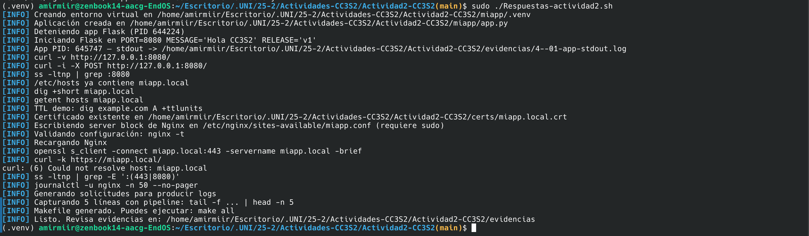
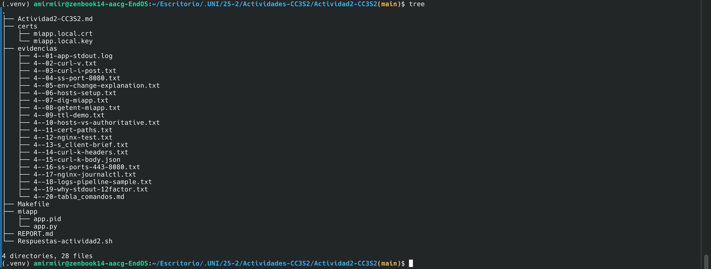
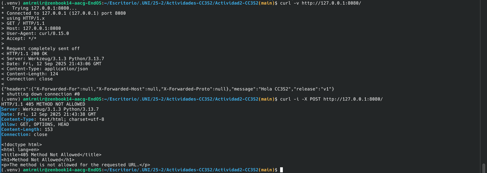

# Actividad 2: HTTP, DNS, TLS y 12-Factor - Reporte

## Objetivo
Practicar despliegues seguros y reproducibles combinando aplicación (HTTP), resolución de nombres (DNS), cifrado en tránsito (TLS) y buenas prácticas 12-Factor (variables de entorno, port binding y logs a stdout).

## 0. Estructura inicial: Cambios y Resultados

Para mi dispositivo EndeavourOS basado en Arch, se necesitaron realizar dos cambios principales para realizar la ejecución del proyecto.

- La ruta de `apt` no existe de base en Arch y se actualizó para el uso de `pacman`
- La ruta de `python3` se actualizó a `python`

La estructura del proyecto creado mediante el archivo Bash es el siguiente:
```bash
(.venv) amirmiir@zenbook14-aacg-EndOS:~/Escritorio/.UNI/25-2/Actividades-CC3S2/Actividad2-CC3S2(main)$ tree
.
├── Actividad2-CC3S2.md
├── certs
│   ├── miapp.local.crt
│   └── miapp.local.key
├── evidencias
│   ├── 4--01-app-stdout.log
│   ├── 4--02-curl-v.txt
│   ├── 4--03-curl-i-post.txt
│   ├── 4--04-ss-port-8080.txt
│   ├── 4--05-env-change-explanation.txt
│   ├── 4--06-hosts-setup.txt
│   ├── 4--07-dig-miapp.txt
│   ├── 4--08-getent-miapp.txt
│   ├── 4--09-ttl-demo.txt
│   ├── 4--10-hosts-vs-authoritative.txt
│   └── 4--11-cert-paths.txt
├── miapp
│   ├── app.pid
│   └── app.py
├── REPORT.md
└── Respuestas-actividad2.sh

```

Dado que no se creó el archivo Make, verificamos el funcionamiento de Nginx:

```bash
(.venv) amirmiir@zenbook14-aacg-EndOS:~/Escritorio/.UNI/25-2/Actividades-CC3S2/Actividad2-CC3S2(main)$ 
(.venv) amirmiir@zenbook14-aacg-EndOS:~/Escritorio/.UNI/25-2/Actividades-CC3S2/Actividad2-CC3S2(main)$ sudo lsof -i :80
COMMAND    PID USER FD   TYPE  DEVICE SIZE/OFF NODE NAME
nginx   634536 root 4u  IPv4 1048398      0t0  TCP *:http (LISTEN)
nginx   634537 http 4u  IPv4 1048398      0t0  TCP *:http (LISTEN)
(.venv) amirmiir@zenbook14-aacg-EndOS:~/Escritorio/.UNI/25-2/Actividades-CC3S2/Actividad2-CC3S2(main)$ curl -I http://localhost:80
HTTP/1.1 200 OK
Server: nginx/1.28.0
Date: Fri, 12 Sep 2025 21:25:18 GMT
Content-Type: text/html
Content-Length: 615
Last-Modified: Sun, 13 Jul 2025 18:15:46 GMT
Connection: keep-alive
ETag: "6873f7d2-267"
Accept-Ranges: bytes

```

Para ello, volvemos a ejecutar, y notamos que ahora funciona:
````bash
(.venv) amirmiir@zenbook14-aacg-EndOS:~/Escritorio/.UNI/25-2/Actividades-CC3S2/Actividad2-CC3S2(main)$ sudo ./Respuestas-actividad2.sh 
[INFO] Creando entorno virtual en /home/amirmiir/Escritorio/.UNI/25-2/Actividades-CC3S2/Actividad2-CC3S2/miapp/.venv
[INFO] Aplicación creada en /home/amirmiir/Escritorio/.UNI/25-2/Actividades-CC3S2/Actividad2-CC3S2/miapp/app.py
[INFO] Deteniendo app Flask (PID 644224)
[INFO] Iniciando Flask en PORT=8080 MESSAGE='Hola CC3S2' RELEASE='v1'
[INFO] App PID: 645747 — stdout -> /home/amirmiir/Escritorio/.UNI/25-2/Actividades-CC3S2/Actividad2-CC3S2/evidencias/4--01-app-stdout.log
[INFO] curl -v http://127.0.0.1:8080/
[INFO] curl -i -X POST http://127.0.0.1:8080/
[INFO] ss -ltnp | grep :8080
[INFO] /etc/hosts ya contiene miapp.local
[INFO] dig +short miapp.local
[INFO] getent hosts miapp.local
[INFO] TTL demo: dig example.com A +ttlunits
[INFO] Certificado existente en /home/amirmiir/Escritorio/.UNI/25-2/Actividades-CC3S2/Actividad2-CC3S2/certs/miapp.local.crt
[INFO] Escribiendo server block de Nginx en /etc/nginx/sites-available/miapp.conf (requiere sudo)
[INFO] Validando configuración: nginx -t
[INFO] Recargando Nginx
[INFO] openssl s_client -connect miapp.local:443 -servername miapp.local -brief
[INFO] curl -k https://miapp.local/
curl: (6) Could not resolve host: miapp.local
[INFO] ss -ltnp | grep -E ':(443|8080)'
[INFO] journalctl -u nginx -n 50 --no-pager
[INFO] Generando solicitudes para producir logs
[INFO] Capturando 5 líneas con pipeline: tail -f ... | head -n 5
[INFO] Makefile generado. Puedes ejecutar: make all
[INFO] Listo. Revisa evidencias en: /home/amirmiir/Escritorio/.UNI/25-2/Actividades-CC3S2/Actividad2-CC3S2/evidencias
(.venv) amirmiir@zenbook14-aacg-EndOS:~/Escritorio/.UNI/25-2/Actividades-CC3S2/Actividad2-CC3S2(main)$ 

````

**Captura: Ejecución del programa**



**Captura: Estructura del proyecto final**



## 1. HTTP: Fundamentos y herramientas

### Configuración inicial

- Puerto configurado via variable de entorno: `PORT=8080`
- Mensaje personalizado: `MESSAGE="Hola CC3S2"`
- Versión de release: `RELEASE="v1"`

### Evidencias curl
```bash
# Inspección básica con curl
curl -v http://127.0.0.1:8080/

# Prueba método POST
curl -i -X POST http://127.0.0.1:8080/
```

**Captura: Resultados de curl**



Notamos que el POST falla, mientras que el GET funciona correctamente para demostrar que a pesar de tener la misma ruta, puede fallar segun el método HTTP que se utilice.

### Logs en stdout

```
[Incluir aquí extractos de los logs de la aplicación]
```

### Puertos abiertos
```bash
ss -ltnp | grep :8080
```

### Pregunta guía - HTTP
**¿Qué campos de respuesta cambian si actualizas `MESSAGE`/`RELEASE` sin reiniciar el proceso? Explica por qué.**

Respuesta: [Incluir aquí tu análisis de qué pasa cuando cambias las variables de entorno sin reiniciar]

### Pregunta guía - Idempotencia HTTP  
**Explica idempotencia de métodos y su impacto en retries/health checks. Da un ejemplo con `curl -X PUT` vs `POST`.**

Respuesta: [Incluir aquí explicación de idempotencia con ejemplos de PUT vs POST]

## 2. DNS: nombres, registros y caché

### Configuración hosts
Agregado a `/etc/hosts`:
```
127.0.0.1 miapp.local
```

### Verificación resolución DNS
```bash
dig +short miapp.local
getent hosts miapp.local
```

### Análisis TTL
```bash
dig example.com A +ttlunits
```

### Pregunta guía - DNS
**¿Qué diferencia hay entre /etc/hosts y una zona DNS autoritativa? ¿Por qué el hosts sirve para laboratorio?**

Respuesta:
- `/etc/hosts` es resolución local estática en el sistema
- Zona DNS autoritativa es servidor que responde queries DNS para dominio específico  
- `/etc/hosts` sirve para laboratorio porque permite mapeo local sin configurar DNS

### Pregunta guía - TTL y caché DNS
**¿Cómo influye el TTL en latencia y uso de caché? Explica con el ejemplo de `dig`.**

Respuesta: [Incluir aquí explicación de cómo TTL afecta el comportamiento de caché DNS]

## 3. TLS: seguridad en tránsito con Nginx

### Certificado autofirmado
```bash
# Generación de certificado (comando usado)
```

### Configuración Nginx
Snippet clave del server block:
```nginx
server {
    listen 443 ssl;
    server_name miapp.local;
    
    ssl_certificate /path/to/cert.crt;
    ssl_certificate_key /path/to/cert.key;
    
    location / {
        proxy_pass http://127.0.0.1:8080;
        proxy_set_header X-Forwarded-For $proxy_add_x_forwarded_for;
        proxy_set_header X-Forwarded-Proto $scheme;
        proxy_set_header Host $host;
    }
}
```

### Validación TLS handshake
```bash
openssl s_client -connect miapp.local:443 -servername miapp.local -brief
curl -k https://miapp.local/
```

### Evidencias de puertos y logs
```bash
ss -ltnp | grep -E ':(443|8080)'
journalctl -u nginx -n 50 --no-pager
```

### Pregunta guía - TLS
**¿Qué rol cumple SNI en el handshake y cómo lo demostraste con `openssl s_client`?**

Respuesta: [Incluir aquí explicación del rol de SNI y cómo se demostró]

## 4. 12-Factor App: port binding, configuración y logs

### Port binding
Evidencia que la app escucha en puerto configurado por variable de entorno.

### Configuración por entorno
Pruebas con diferentes valores de `MESSAGE` y `RELEASE`.

### Logs a stdout
Redirección a archivo y explicación de por qué no se configura log file en la app.

### Pregunta guía - 12-Factor
**¿Por qué logs a stdout y config por entorno simplifican contenedores y CI/CD?**

Respuesta: [Incluir aquí explicación de beneficios para contenedores y CI/CD]

## 5. Operación reproducible

### Comandos documentados
| Comando | Resultado esperado |
|---------|-------------------|
| `make prepare` | Configuración inicial |
| `make run` | Ejecutar aplicación |
| `make nginx` | Configurar Nginx |
| `make check-http` | Verificar HTTP |
| `make check-tls` | Verificar HTTPS |

### Pregunta guía - Troubleshooting
**¿Qué muestra `ss -ltnp` que no ves con `curl`? ¿Cómo triangulas problemas con `journalctl`/logs de Nginx?**

Respuesta: [Incluir aquí comparación entre ss y curl, uso de journalctl para diagnóstico]


## Mejoras incrementales

### Logs estructurados JSON
Ejemplo de logs estructurados y ventajas para parsing.

### Script make end-to-end
Descripción del flujo completo automatizado.

### Systemd (si aplica)
Configuración de unidad systemd y evidencias.